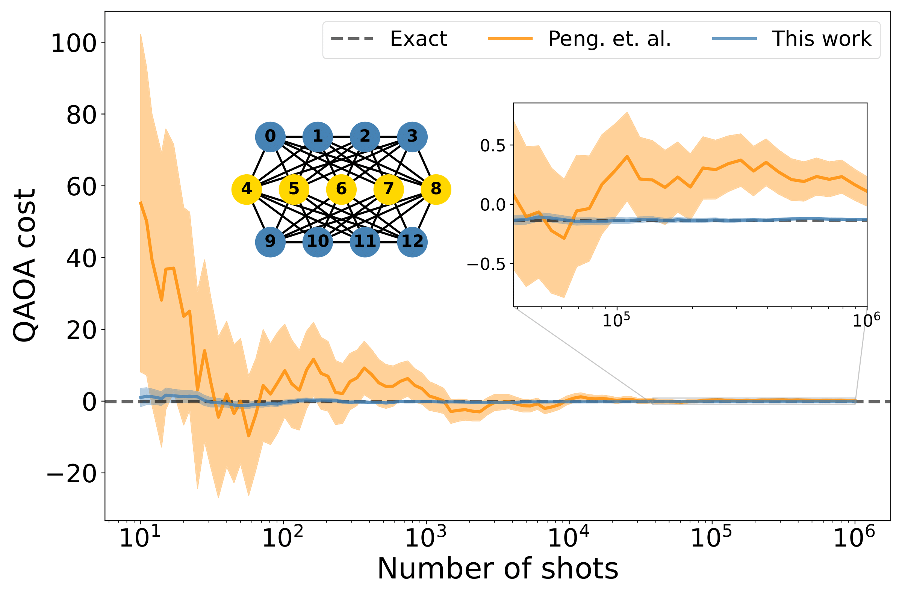
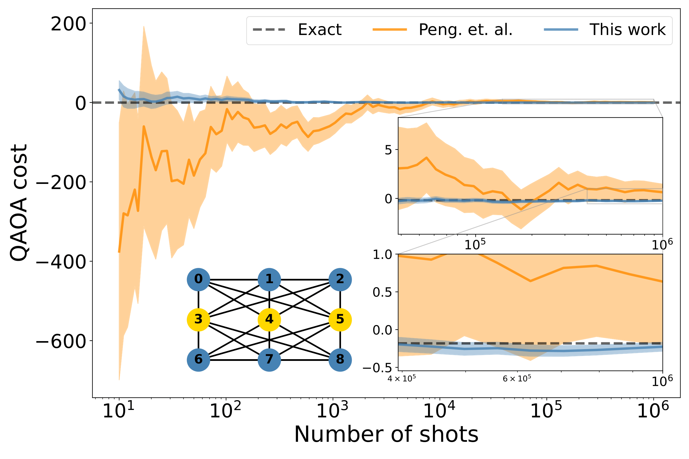
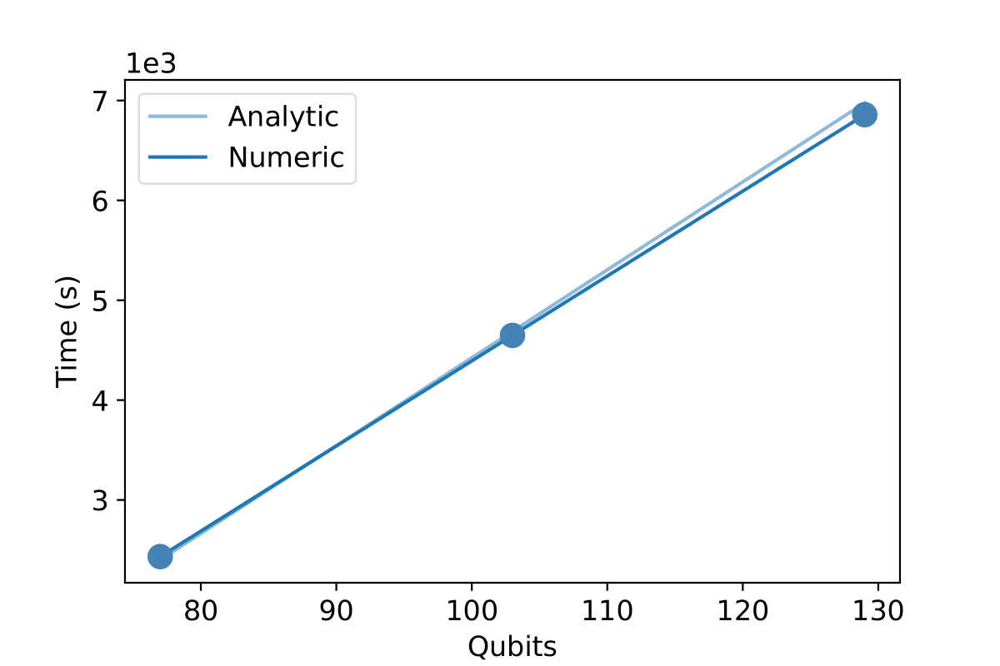
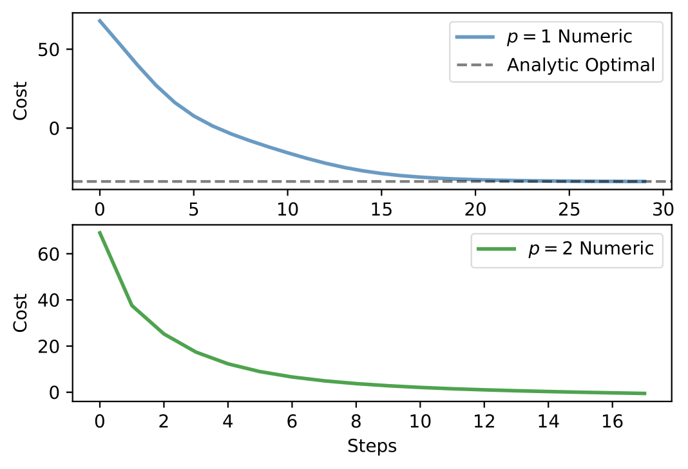
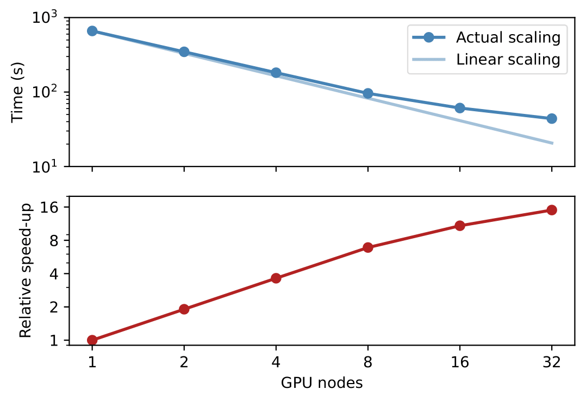

# Fast quantum circuit cutting with randomized measurements

- Benchmarking of the randomized circuit cutting method against [Peng et al.](https://arxiv.org/abs/1904.00102)

<p float="left">
  
   
</p>

- Large scale QAOA simulations using circuit cutting methods executed over multiple GPUs.

<p float="left">
  
  
</p>

<p float="left">
  
   
</p>

### Contents

- `optimize.py`: Python script for performing full QAOA distributed over multiple GPUs using circuit cutting methods. This was used to produce the results in the accompanying paper.

- `forward_pass.py`: Python script for executing forward passes of QAOA circuits (no gradients/optimization) distributed over multiple GPUs using circuit cutting methods.

- `exact_costs.ipynb`: Jupyter notebook for analysis of exact cost values of single layer QAOA circuits. This uses results from this [paper](https://arxiv.org/pdf/2009.01760.pdf) and the accompanying [repository](https://github.com/Matematija/QubitRBM)

- `utils.py`: Python script containing utility functions for constructing problem graphs to be input to QAOA for Max-Cut and building the corresponding quantum circuit. 

- `data/`: Folder containing example output logs generated from above scripts. This data was used to generate the plots in the accompanying paper.

- `randomized/`: Folder containing python scripts for randomized cuts based on mixed-state simulators in PennyLane. These were used to generate benchmarking results against against [Peng et al.](https://arxiv.org/abs/1904.00102)

### Usage

The python scripts can be executed by running the following command from the corresponding directory:

```
$ python <file_name.py>
```

File paths for the output data may need to be updated depending on your local machine and operating system.

Note that usage of multiple GPUs will require specific configurations unique to the hardware being used. Our results were generated through the use of [slurm](https://slurm.schedmd.com/gres.html) for job submission.

To visualize the content of the Jupyter notebooks without running the code there are two alternatives:

1. Navigate with a browser to the GitHub repository and simply click on the notebook file. GitHub will automatically visualize the notebook, however the rendering may vary in quality (especially for LaTeX formulas).

2. Copy the URL of the notebook file and paste it into [nbviewer](https://nbviewer.org/).

To open and run a local copy of a notebook one should apply the following steps:

1. If missing, install JupyterLab.
2.  Run the command:

```
$ jupyter notebook
```

3. Navigate to the local notebook file and open it.

You can also visit [pennylane.xanadu.ai](https://pennylane.xanadu.ai) to run notebooks over Xanadu Cloud.

### Requirements

All software requirements for running the provided python scripts can be installed by running the following command from the top level directory: 

```
$ pip install -r requirements.txt
```

This requires [`pip`](https://pip.pypa.io/en/stable/installation/)  to be installed on your machine. 

We also recommend the use of a virtual environment (e.g [`venv`](https://docs.python.org/3/library/venv.html)) when installing these requirements. 

Note that the PennyLane dependency is installed from a development branch containing the necessary updates to perform efficient measurements of the cost Hamiltonians used in the QAOA circuit simulations. 

Additionally, if running the notebook `exact_costs.ipynb`, this will require an additional installation of the code available in this [repository](https://github.com/Matematija/QubitRBM) that is not included in the requirements.

### Authors

Angus Lowe, Matija Medvidovi&#263;, Anthony Hayes, Lee J. O’Riordan, Thomas R. Bromley, Juan Miguel Arrazola, and Nathan Killoran

If you are doing any research using this source code, please cite the following paper:

> Angus Lowe, Matija Medvidovi&#263;, Anthony Hayes, Lee J. O’Riordan, Thomas R. Bromley, Juan Miguel Arrazola, and Nathan Killoran. _Fast quantum circuit cutting with randomized measurements_. [arXiv:2207.14734](https://arxiv.org/abs/2207.14734) (2022).

### License

This source code is free and open source, released under the Apache License, Version 2.0.

